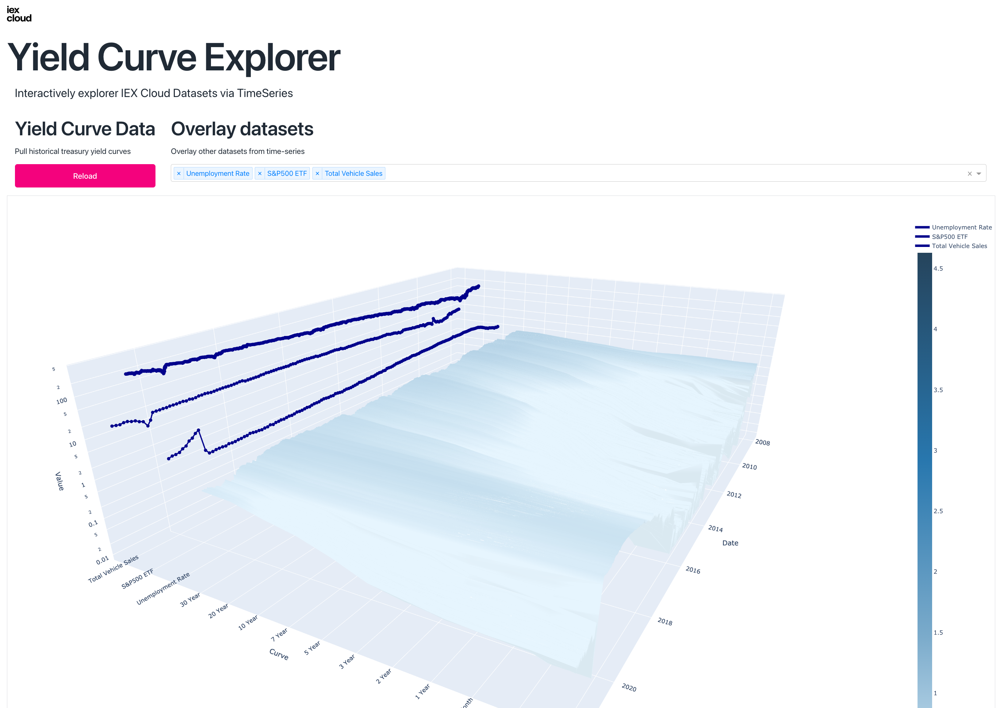

# IEX Cloud - examples
Example applications built using IEX Cloud data.

| | | | | |
|:---:|:---:|:---:|:---:|:---:|
| </img> | Yield Curve | Dash | TimeSeries, Treasuries, Economic | [link](./iexexamples/dash/yield_curve/README.md) |
| | Timeseries Downloader | Dash | TimeSeries | [link](./iexexamples/dash/timeseries_downloader/README.md) |

## Setup
Install dependencies

`python -m pip install -e .`

