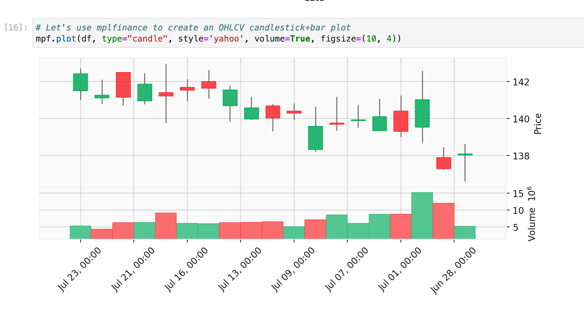

# IEX Cloud - examples
Example applications, dashboards, scripts, notebooks, and other utilities built using [IEX Cloud](https://iexcloud.io/).

# ⚠️ This collection is under active development. [Reach out with comments, questions, or suggestions](https://iexcloud.io/community/developer)

| Preview | Name | Type | Language | Frameworks / Libraries | Datasets | Link |
|:---:|:---:|:---:|:---:|:---:|:---:|:---:|
| </img> | OHLCV | Notebook | Python | Pandas, Matplotlib, Plotly | Historical Prices | [link](./notebooks/1_OHLCV.ipynb) |
| </img> | Timeseries Downloader | App | Python | Dash, Pandas | TimeSeries | [link](./iexexamples/dash/timeseries_downloader/) |
| </img> | Yield Curve | App | Python | Dash, Pandas | TimeSeries, Treasuries, Economic | [link](./iexexamples/dash/yield_curve/) |

## Setup
Install dependencies

`python -m pip install -e .`

## License

This software is licensed under the Apache 2.0 license. See the
[LICENSE](LICENSE) and [AUTHORS](AUTHORS) files for details.