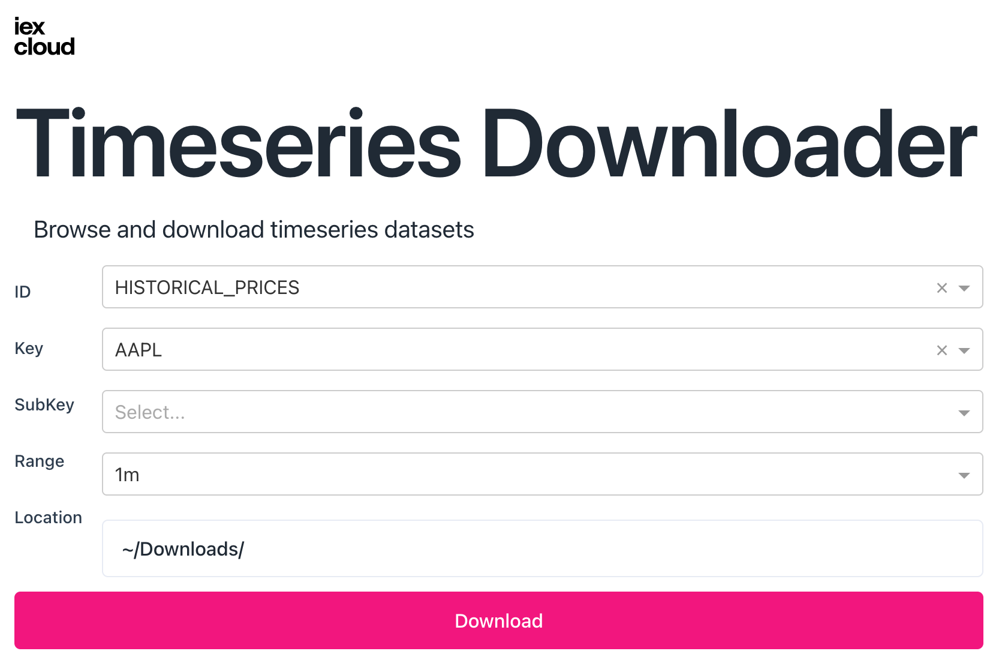

# Timeseries Downloader
Download Datasets from [time-series](https://iexcloud.io/docs/api/#time-series) as CSV

</img>

## Run
Run with:

`IEX_TOKEN=pk_... python -m iexexamples.dash.timeseries_downloader`

Or with sandbox data:

`make timeseries_downloader` 
